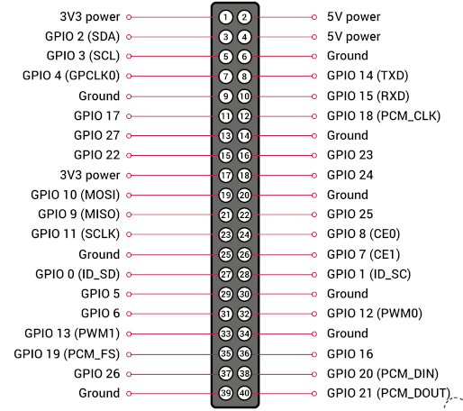

# hello-rpi-bme680
Simple Rust application for home atmosphere monitoring system based on Rpi Zero, Bme680 sensor and WaveShare 2.13" V2 e-paper display.

## Hardware set-up
1. bme680 sensor requires a turning on I2C interface of Raspberry Pi (` sudo raspi-config -> Interfacing Options -> I2C -> Yes`).
2. e-Paper display requires a turning on SPI interface (` sudo raspi-config -> Interfacing Options -> SPI -> Yes `). 
3. Raspberry Pi Zero pins: 
4. Raspberry Pi pins mapping I2C connection for sensor:
   
   | BME680 | BCM2835| Physical board pin |
   |--- | --- | ---|
   |Vin | 3.3V | 3.3V |
   |Vdd | do not connect |do not connect |
   |SDA | SDA |	3 |
   |SCL | SCL |	5 |
   |GND | GND |	GND |

5. Raspberry Pi pins mapping SPI connection for display:

   |e-Paper |BCM2835 |Physical board pin|
   |--- | --- | --- |
   |VCC | 3.3V |3.3V|
   |GND | GND  |GND|
   |DIN | MOSI |19 |
   |CLK | SCLK |23 |
   |CS  | CE0  |24 |
   |DC  | GPIO 25 |22 |
   |RST | GPIO 17 |11 |
   |BUSY| GPIO 24 |18 |

## Local run on rpi 
The main idea of getting data from sensor is taken from examples in [the repo of bme680 crate](https://github.com/marcelbuesing/bme680).

Before running the code you should determine i2c address of sensor connected to rpi with command:

`sudo i2cdetect -y 1`

And add last two-digit number from result print as environment variable *BME_I2C_ADDRESS* during run program in console below.
If you can build the code directly on Raspberry Pi, compile and build it with cargo and run in console:

` sudo RUST_LOG=info BME_I2C_ADDRESS=76 target/debug/hello-rpi-bme680 `

To avoid a using ` sudo` we have to allow access for our user to ` /dev/i2c-1` with adding into ` i2c` group:

` sudo usermod -a -G i2c ${USERNAME}`

However in my case I decided build and compile the code on my own linux workstation and after deploy it on rpi and run.
To 'speak in the same language' with raspberry pi zero we add the build target:

` rustup target add arm-unknown-linux-gnueabihf`

Download and install [GNU Toolchain](https://developer.arm.com/downloads/-/gnu-a) linker for rpi zero on a workstation - The __gcc-arm-8.3-2019.03-x86_64-arm-linux-gnueabihf.tar.xz__ works fine for me. Don't miss link it into __$PATH__ after extracting.

After adding a reference to linker into [.cargo/config.toml](.cargo/config.toml) file, we can run cross build
for debug purposes:

` cargo build --target arm-unknown-linux-gnueabihf`

And now we have created the file ` target/arm-unknown-linux-gnueabihf/debug/hello-rpi-bme680` ready for deployment.
But this version is not optimized, for "production" ready set-up we need to use ` --release` flag in build command:

` cargo build --target arm-unknown-linux-gnueabihf --release`

and now our executable artifact locate here ` target/arm-unknown-linux-gnueabihf/release/hello-rpi-bme680` and has more efficient optimizations.

## Docker run
[WIP]

## Display sensor data
[WIP]
